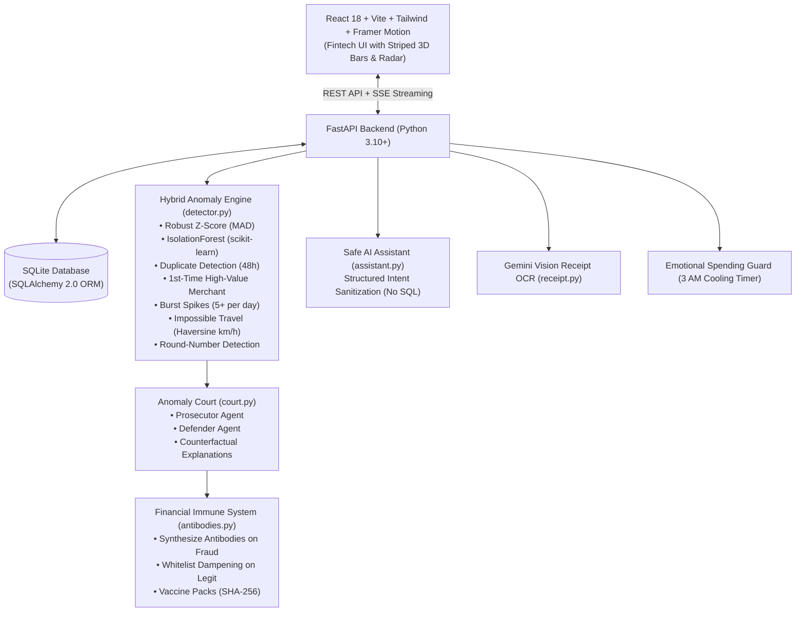

# ExpenseGuard: The Financial Immune System

> *"It doesn't just track spending. It builds immunity against fraud, argues the case in court, and protects you from your own 3 AM impulses."*

---

## 🚀 Live Local Links
- **Frontend Web Application:** [http://localhost:5173](http://localhost:5173)
- **FastAPI Backend:** [http://localhost:8000](http://localhost:8000)
- **Interactive Swagger Docs:** [http://localhost:8000/docs](http://localhost:8000/docs)

---

## ⚡ Quick One-Command Run
```cmd
run.bat
```
*(On Linux/macOS: `./run.sh`)*

---

## 🏛️ System Architecture



---

## 🌟 Feature Tour & Highlights

1. **Fintech Aesthetics (Inspired by Reference UI)**
   - 3D Hatched/Striped Funnel bars showing transaction clearance stages.
   - Hero Gross Volume card with `▲ %` pills and striped sub-progress bars.
   - Step-line daily spend chart with vertical hairlines and anomaly highlight pills.
   - Dot Matrix weekday frequency histograms (`Peak: Wed`).
   - Gradient Insights card displaying the hero **Immunity Score (0-100%)**.

2. **Flagship: Anomaly Courtroom**
   - Click **Take to Court** on any flagged charge.
   - Dual-agent simulated trial: **Prosecutor** (citing detector evidence) vs. **Defender** (citing user tenure and relationship).
   - User acts as Judge: ruling **Fraud** generates a persistent **Antibody**; ruling **Legit** whitelists the pattern.

3. **Live Fraud Simulator (Demo Showstopper)**
   - Click the top-right **Inject Fraud** button.
   - Injects Duplicate Charges, 15× Spikes, 3 AM Purchases, or Impossible Travel (Bengaluru ➔ Delhi in 45m).
   - Broadcasts instant real-time toasts via Server-Sent Events (SSE).

4. **Emotional Spending Guard**
   - Flags late-night (11 PM – 5 AM) or stress-pattern transactions.
   - Triggers a 10-minute cooling timer (with a 10-second hackathon demo accelerator toggle).
   - Tracks "Impulse spend avoided" on the dashboard.

5. **Spend DNA Fingerprint**
   - Radial SVG biometric radar showing unique spending tendencies with red anomaly glitch spikes.

6. **Herd Immunity (Vaccine Packs)**
   - Export your learned antibodies as tamper-evident JSON sealed with SHA-256.
   - Inoculate peers by importing external vaccine packs (Acquired Immunity).
